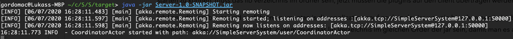

# SyncDir
SyncDir is a tool that you can use to synchronize directories of computers on the same network.

This process is carried out asynchronously, no permanent internet connection is required. Data is transferred in parallel via Akka; Any amount of data of any size can be synchronized.
The architecture is based on a client-server architecture. Any number of clients can be connected to the server. Attention: The simultaneous synchronization of clients with the server is currently not supported.
The following actions trigger a synchronization: file added, file deleted, file updated.

