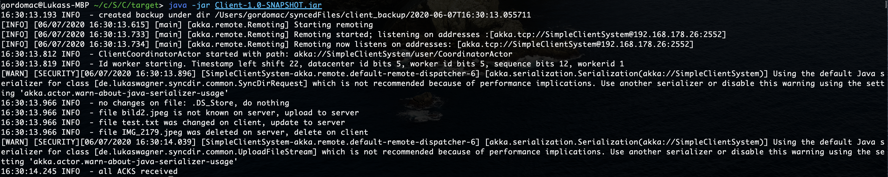

# SyncDir
SyncDir is a tool that you can use to synchronize directories of computers in the same network.

This process is carried out asynchronously, no permanent internet connection is required. Data is transferred in parallel via Akka; Any amount of data of any size can be synchronized.
The architecture is based on a client-server architecture. Any number of clients can be connected to the server. Attention: The simultaneous synchronization of clients with the server is currently not supported.
The following actions trigger a synchronization: file added, file deleted, file updated.

## How to run the system




## How to configure your system

To adapt the system to your needs, you have to edit the application.conf files, which are located in the client and server directory.

### Client Confifg

```
akka {
  log-dead-letters-during-shutdown = off
  actor {
    provider = remote
    deployment {
      /Messages {
        remote = "akka.tcp://SimpleServerSystem@127.0.0.1:50000"
      }
    }
  }
}

# enter your sync dir paths here
de.lukaswagner.client {
#   directory undergoing
    syncDir = "/Users/gordomac/syncedFiles/client"
#   backups are created here
    backupDir = "/Users/gordomac/syncedFiles/client_backup"
#   status of the system will be saved here
    historizedFileChecksumPath = "/Users/gordomac/syncedFiles/client_historizedFileIds"
}
```

### Server Config

```
akka {
  actor {
    provider = remote
  }
  remote {
    enabled-transports = ["akka.remote.netty.tcp"]
    netty.tcp {
      hostname = "127.0.0.1"
      port = 50000
    }
  }
}

# enter your sync dir paths here
de.lukaswagner.server {
#   directory undergoing
    syncDir = "/Users/gordomac/syncedFiles/server"
}
```

        remote = "akka.tcp://SimpleServerSystem@127.0.0.1:50000"
